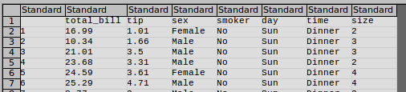

# Tips_dataset_analysis
Fundametals of Data Analysis - assignment project, GMIT 2019

>Author: **Andrzej Kocielski**  
>Github: [andkoc001](https://github.com/andkoc001/)  
>Email: G00376291@gmit.ie, and.koc001@gmail.com

Created: 22-09-2019,
Last update: 29-09-2019  

___

## Content (to be updated)

1. Introduction
2. The data set
   1. Origin
   2. Insight into raw data
3. Tools used for the data analysis
   1. Python language, libraries and modules
   2. Jupyter Notebook
4. The analysis
5. Findings and conclusion  
References
___

## 1. Introduction

This is my assignment project to Fundametals of Data Analysis module, Galway-Mayo Institute of Technology, 2019. Lecturer: dr Ian McLoughlin.

This GitHub repository documents my research, project progress (including comments for my future reference) and findings of the `Tips` data set analysis.

This project is intended to furhter familiarisation with data analytics. The data set was chosen for its relative simplicity.

The intention of the project is to get practical understanding of handling data in Python environment. It is also intended to get familiar with the analytical tools. The tools include Python language and additional packages (Pandas, Numpy, Seaborn, etc.) as well as Jupyter Notbook.

The primary objectives are as follows:
- Data description,
- Regression,
- Analyse.

As an outcome of the excercie, it is hoped to become acquentant with data analytics concepts, including data types and structures handling, data splicing, plots generation and interpretation. It is also hoped to get good marks for the module!

## 2. The data set

### 2.1 Origin

The dataset and is a representation of tips given in a restaurant.

The dataset is integrated with the [Seaborn]<https://seaborn.pydata.org/> package, an external Python package for data visualisation.

The dataset can be also obtained from <http://vincentarelbundock.github.io/Rdatasets/datasets.html>.

### 2.2 Insight into raw data

Raw dataset, as a .csv file, obtained from: <http://vincentarelbundock.github.io/Rdatasets/datasets.html>.

The first few rows look like this:  

A quick review of the raw data in the csv file reveals the following findings:

1. The data set is organised in 8 columns, and 244 rows - instances (excluding the headers).
2. Columns 1 is an `int` type and consist of the instance number.
3. (to be updated...)

## 3 Tools used for the data analysis

### 3.1 Python language, libraries and modules

Python programming language is acclaimed for its capacity of handling large amount of data in scientific community of different specialisation. Its natural functionality has been extended by development of external libraries dedicated for specific purposes. Below are listed several I used for accomplishment of this project.

1. Numpy
   >NumPy is a library for the Python programming language, adding support for large, multi-dimensional arrays and matrices, along with a large collection of high-level mathematical functions to operate on these arrays. - Wikipedia
2. Pandas
   >Pandas is a software library written for the Python programming language for data manipulation and analysis. In particular, it offers data structures and operations for manipulating numerical tables and time series. - Wikipedia
3. Matplotlib
   >Matplotlib is a plotting library for the Python programming language and its numerical mathematics extension NumPy. - Wikipedia
4. Seaborn
   >Seaborn is a Python data visualization library based on matplotlib. It provides a high-level interface for drawing attractive and informative statistical graphics. - seaborn.pydata.org

## 4. The analysis

The analysis was initially intended to be carried out using Python scripts. However, in due course, the advantages of Jupyter Notebook tool has been  recognised, resulting in migration of the analysis from Python scripts to corresponding Jupyter Notebook.

A Jupyter Notebook for the project is created: **`Tips_dataset_analysis.ipynb`**. The analysis description, progress and results have been recorded in the Jupyter Notebook.

The program and the Jupyter Notebook are reposited at: <https://github.com/andkoc001/Tips_dataset_analysis/>.

### 4.1 Variables

The following are the variables I created and used for completion of the project - listed here for reference.

| \#  | Variable | Type      | Description      |
| --- | -------- | --------- | ---------------- |
| 1   | `aaa`    | DataFrame | (to be added...) |
| 2   | `bbbb`   | DataFrame | (to be added...) |

## 5. Findings and conclusion

(Findings to be added...)

Data analysis is a powerful technique in relation to objects classification and machine learning. The tools used in the project - Python language and its libraries - offer a lot of functionality, of which just few were utilised. Much more is still to be learnt.

___

## References

### Project and the data set related

- Raw dataset obtained from: <http://vincentarelbundock.github.io/Rdatasets/datasets.html>

### General Python related

- GMIT Fundamentals of Data Analysis module materials on Moodle platform (access may be restricted for staff and students): <https://learnonline.gmit.ie/course/view.php?id=689>
- Python 3 tutorial documentation: <https://docs.python.org/3/tutorial/>
- A Whirlpool Tour of Python by Jake VanderPlas: <https://www.oreilly.com/programming/free/files/a-whirlwind-tour-of-python.pdf>
- The Coder's Apprentice by Pieter Spronock: <http://spronck.net/pythonbook/pythonbook.pdf>
- Python reference: <https://www.w3schools.com/python/python_reference.asp>
- Modules vs Packages vs Libraries in Python: <https://knowpapa.com/modpaclib-py/>
- Python tutorial for beginners: <https://codewithmosh.com>, <https://youtu.be/_uQrJ0TkZlc>
- Stack Overflow forum: <https://stackoverflow.com>
- Python puzzles: <https://blog.finxter.com/>

### Python modules and packages

- Intro to Python packages: <https://data36.com/python-libraries-packages-data-scientists/>
- Anaconda User Guide: <https://docs.anaconda.com/anaconda/user-guide/>
- Matplotlib documentation: <https://matplotlib.org/contents.html>
- 10 Minutes to Pandas: <https://pandas.pydata.org/pandas-docs/stable/getting_started/10min.html>
- Pandas tutorial: <http://www.datasciencemadesimple.com/head-and-tail-in-python-pandas/>
- Pyplot Tutorial: <https://matplotlib.org/users/pyplot_tutorial.html>
- Jupyter documentation: <https://jupyter.org/documentation>
- Jupyter intro: <https://medium.com/ibm-data-science-experience/back-to-basics-jupyter-notebooks-dfcdc19c54bc>
- Jupyter tips and tricks: <https://www.dataquest.io/blog/jupyter-notebook-tips-tricks-shortcuts/>
- Seaborn tutorial: <https://seaborn.pydata.org/tutorial.html>

### Data analysis, Deep Learning, Machine Learning, Statistics

- Seaborn tutorial: <https://seaborn.pydata.org/tutorial.html>
- A Complete Tutorial to Learn Data Science with Python from Scratch: <https://www.analyticsvidhya.com/blog/2016/01/complete-tutorial-learn-data-science-python-scratch-2/>
- The ultimate machine learning course with python in 6 steps: <https://copycoding.com/d/the-practical-guide-to-learn-machine-learning-with-python-in-12-steps->
- Tutorial to data analysis: <https://machinelearningmastery.com/machine-learning-in-python-step-by-step/>
- Data visualisation in Python: <https://medium.com/python-pandemonium/data-visualization-in-python-line-graph-in-matplotlib-9dfd0016d180>
- DataFrame tutorial: <https://www.datacamp.com/community/tutorials/pandas-tutorial-dataframe-python>
- iris data analysis example: <https://www.slideshare.net/thoi_gian/iris-data-analysis-with-r>
- Classifying Species of Iris Flowers: <https://www.kaggle.com/anthonyhills/classifying-species-of-iris-flowers>

### Github and Markdown

- An Introduction to Version Control Using GitHub Desktop: <https://programminghistorian.org/en/lessons/getting-started-with-github-desktop>
- Mastering Markdown: <https://guides.github.com/features/mastering-markdown/>
- Markdownlint Rules: <https://github.com/DavidAnson/markdownlint/blob/v0.12.0/doc/Rules.md>

### Fellow students

Much inspiration, ideas, directions and solutions throughout the project has been obtained from my fellow students of the course. Thank you all!
